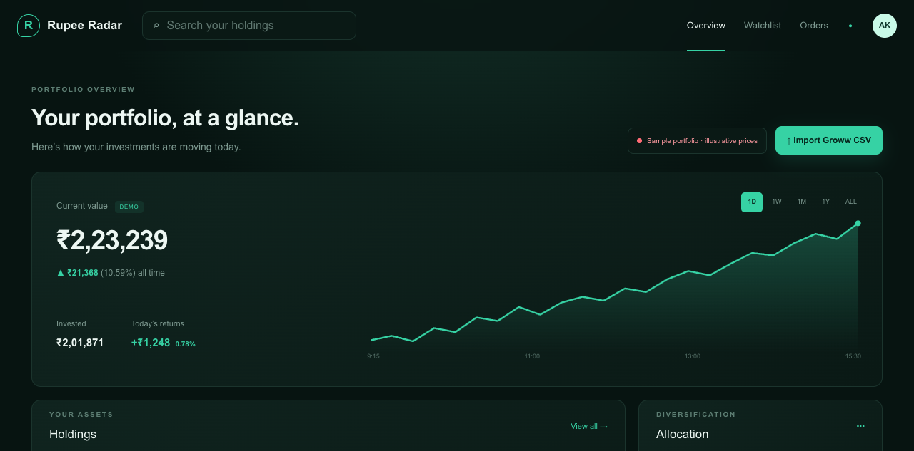

# Rupee Radar

A portfolio dashboard for exploring holdings, returns, and allocation in a clean, responsive interface.

**[Open the live demo →](https://rupee-radar-kappa.vercel.app)** · [Setup and deployment](docs/SETUP.md) · [Report an issue](https://github.com/AviralKhanna/rupee-radar/issues)



## What you can try

- Explore an illustrative portfolio and its value chart.
- Search holdings and compare allocation.
- Import a simple CSV to calculate totals using your own holdings.
- Switch chart ranges and explore the responsive dashboard layout.

The public site needs no account. Demo prices and chart movements are illustrative, not a live market feed. CSV imports are processed in the browser and are not uploaded by this app.

## Run locally

Requires Node.js 22.13 or newer and npm.

```sh
git clone https://github.com/AviralKhanna/rupee-radar.git
cd rupee-radar
npm ci
npm run dev -- --port 3010
```

Open **http://localhost:3010**.

## Try a CSV

Save the following as `holdings.csv`, then select **Import Groww CSV**:

```csv
symbol,name,quantity,average,current
DEMOA,Example Software,10,100,120
DEMOB,Example Bank,20,50,55
```

Use plain numbers without thousands separators. The current parser handles simple comma-separated rows; quoted fields containing commas and every broker export variant are not supported. Imported holdings are not persisted across reloads.

## Technology

| Area | Stack |
| --- | --- |
| Application | Next.js 16, React 19, TypeScript |
| Styling | CSS and Tailwind CSS 4 tooling |
| Charts | HTML canvas |
| Deployment | Vercel |

## Project structure

```text
app/page.tsx          Portfolio dashboard and CSV import
app/globals.css       Dashboard styling
app/api/groww/        Disabled-by-default brokerage integration
public/              Static assets
vercel.json          Vercel configuration
```

The repository also retains files from the original vinext/Cloudflare starter. The current application uses the Next.js commands in `package.json`.

## Validation

```sh
npm run lint
npm run build
```

The production build includes TypeScript checks. The legacy file in `tests/rendered-html.test.mjs` targets the previous starter screen and is not a current dashboard test suite.

## Scope

This is a portfolio interface demo, not a trading platform. Some navigation controls are UI placeholders. The public `/api/groww` endpoint intentionally rejects live account access. Do not expose a shared personal brokerage account through a public deployment.

## Author

Built by [Aviral Khanna](https://github.com/AviralKhanna).
